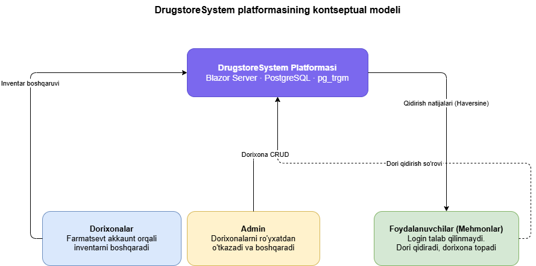

# I BOB. DORIXONA AXBOROT TIZIMLARINI RAQAMLASHTIRISH VA OPTIMALLASHTIRISH ALGORITMLARINING NAZARIY ASOSLARI

## 1.1. Zamonaviy dorixona boshqaruv tizimlari va farmatsevtika sohasini raqamlashtirish

Zamonaviy sog'liqni saqlash tizimida farmatsevtika sohasini raqamlashtirish masalasi tobora muhim ahamiyat kasb etmoqda. Dori vositalariga bo'lgan talab yildan yilga ortib borayotgan bir sharoitda, dorixonalar o'z inventarini samarali boshqarish, foydalanuvchilar esa kerakli dorini tezda topish imkoniyatiga muhtoj. Axborot texnologiyalarining jadal rivojlanishi farmatsevtika sohasidagi an'anaviy jarayonlarni — qo'lda yurituladigan inventar daftarlardan tortib, zamonaviy raqamli platformalargacha — tubdan o'zgartirib yubordi. Xususan, bir nechta dorixonani birlashtiruvchi multi-pharmacy platformalar foydalanuvchilarga kerakli dorini qaysi dorixonada va qanday narxda topish mumkinligini bir zumda aniqlash imkonini berib, sog'liqni saqlash tizimidagi muhim bo'shliqni to'ldirmoqda.

### Dorixona axborot tizimlarining rivojlanish bosqichlari

Dorixona boshqaruv tizimlarining rivojlanish tarixi bir necha muhim bosqichni o'z ichiga oladi. Birinchi bosqichda — an'anaviy davrda — dorixonalardagi barcha ma'lumotlar qog'oz daftarlar va kartotekalar orqali yuritilgan, dori inventarini tekshirish uchun esa bevosita dorixonaga borish yoki telefon qilish zarur bo'lgan. Ikkinchi bosqichda — kompyuterlashtirish davrida — yakka dorixonalar uchun izolyatsiyalangan dasturiy yechimlar paydo bo'ldi: Microsoft Excel jadvallar va oddiy ma'lumotlar bazalari yordamida inventar boshqarildi, biroq bu tizimlar dorixonalar o'rtasida ma'lumot almashish imkoniyatidan mahrum edi. Uchinchi bosqichda tarmoq texnologiyalarining rivojlanishi bilan zanjir dorixonalar uchun markazlashgan boshqaruv tizimlari vujudga keldi — bir kompaniyaga qarashli barcha filiallarning inventar ma'lumotlari yagona tizimda jamlandi. To'rtinchi, hozirgi bosqichda esa bulutli texnologiyalar, geolokatsiya xizmatlari va fuzzy qidiruv algoritmlari asosida qurilgan ochiq multi-pharmacy platformalar rivojlanmoqda — bu platformalar har qanday mustaqil dorixonani yagona ekotizimga birlashtirish imkonini beradi.

### Multi-pharmacy platformalar va ularning tuzilishi

Multi-pharmacy platforma — bu bir nechta mustaqil dorixonani yagona raqamli muhitda birlashtiruvchi axborot tizimi bo'lib, foydalanuvchilarga qidiruv, solishtirish va yo'naltirish xizmatlarini taqdim etadi. Bunday platformalarda odatda uch xil foydalanuvchi roli mavjud bo'ladi. Administrator roli platformaning umumiy boshqaruvini amalga oshiradi — yangi dorixonalarni ro'yxatdan o'tkazadi, ularning faolligini nazorat qiladi va umumiy statistikani kuzatib boradi. Farmatsevt roli o'z dorixonasining profilini va dori inventarini boshqaradi — narx, miqdor va mavjudlik ma'lumotlarini yangilab turadi. Mehmon foydalanuvchi roli esa hech qanday ro'yxatdan o'tmasdan dori qidiradi, narx va masofani solishtiradi hamda o'ziga qulay dorixonani tanlaydi. Har uch rolning uyg'un ishlashi platformaning asosiy qiymatini yaratadi: farmatsevtlar inventarini yangilab tursa, foydalanuvchilar real vaqtda to'g'ri ma'lumot oladi. Bunday arxitektura platformaning afzalligini ham, murakkabligini ham belgilab beradi — chunki turli manfaatdor tomonlarning talablarini bir vaqtda qondirish alohida loyihalash mahoratini talab qiladi.

### Umumiy dori katalogi (Shared Catalog) konsepsiyasi

Zamonaviy multi-pharmacy platformalarning eng muhim arxitektura elementi — bu barcha farmatsevtlar tomonidan birgalikda to'ldiriladigan umumiy dori katalogi (shared catalog) konsepsiyasidir. An'anaviy yondashuvda har bir dorixona o'z dori ro'yxatini mustaqil yuritadi, bu esa bir xil dorining yuzlab turli nomda kiritilishiga va ma'lumotlarning parchalanib ketishiga olib keladi. Umumiy katalog yondashuvi bu muammoni bartaraf etadi: birinchi marta yangi dori qo'shayotgan farmatsevt uni butun platforma uchun yaratadi, qolgan farmatsevtlar esa autocomplete funksiyasi orqali mavjud dorini topib, o'z inventariga qo'shadi. Natijada dori haqidagi ma'lumotlar — nomi, generik nomi, rus tilida nomi, sinonim savdo nomlari, kategoriyasi, ishlab chiqaruvchisi — bir marta kiritiladi va barcha foydalanuvchilar tomonidan birgalikda boyitib boriladi. Bu yondashuv crowdsourcing tamoyiliga asoslanib, katta ma'lumotlar bazasini nisbatan kam sarf bilan shakllantirish imkonini beradi.

### Farmatsevtika sohasini raqamlashtirishning afzalliklari

Farmatsevtika sohasiga axborot texnologiyalarini joriy etishning bir qator muhim afzalliklari mavjud bo'lib, ular nafaqat dorixona uchun, balki fuqarolar uchun ham sezilarli darajada hayot sifatini oshiradi. Birinchi afzallik — vaqtni tejash: foydalanuvchi kerakli dorini qaysi dorixonada topishini oldindan bilib, maqsadli ravishda yo'l oladi va bo'sh dorixonalarni aylanib chiqish zaruriyatidan qutiladi. Ikkinchi afzallik — narxlarni solishtirish: bir xil dori turli dorixonalarda turli narxda sotilishi mumkin bo'lib, raqamli platforma foydalanuvchiga eng arzon variantni bir zumda ko'rsatadi. Uchinchi afzallik — masofa bo'yicha saralash: geolokatsiya asosida eng yaqin dorixonani aniqlash foydalanuvchining yo'l xarajati va vaqtini kamaytiradi, bu esa ayniqsa keksa yoki harakati cheklangan bemorlar uchun muhim. To'rtinchi afzallik — inventar shaffofligi: dorixona rahbariyati o'z inventarining real holatini kuzatib boradi va kam qolgan tovarlarni o'z vaqtida to'ldiradi. Beshinchi afzallik — raqobat muhiti: ochiq platforma dorixonalar o'rtasida sog'lom raqobatni rag'batlantiradi, bu esa narxlar pasayishiga va xizmat sifatining oshishiga olib keladi.

### Muammolar va cheklovlar

Biroq, dorixona axborot tizimlarini joriy etishda bir qator muammolar va cheklovlar ham mavjud bo'lib, ularga alohida e'tibor qaratish lozim. Birinchi muammo — ma'lumotlar sifati: farmatsevtlar tomonidan kiritilgan inventar ma'lumotlari doimo yangilanib turilmasa, foydalanuvchi platformada mavjud ko'ringan dorini dorixonada topa olmaydi, bu esa tizimga ishonchni pasaytiradi. Ikkinchi muammo — dori nomlarining ko'p tillilik muammosi: O'zbekistonda dori nomlari o'zbek, rus va ingliz tillarida turlicha yoziladi ("Paracetamol", "Парацетамол", "Paratsetamol"), oddiy qidiruv tizimlari esa bu variantlarni bir-biriga bog'lay olmaydi. Uchinchi muammo — geolokatsiya aniqligi: foydalanuvchining joylashuvi aniq bo'lmasa yoki dorixona koordinatalari noto'g'ri kiritilgan bo'lsa, masofa hisoblash natijasi ishonchsiz chiqadi. To'rtinchi muammo — internet infratuzilmasi: hamma dorixonada barqaror internet aloqasi mavjud emas, bu esa real vaqt inventar yangilanishini qiyinlashtiradi. Ushbu muammolarni anglagan holda tizimni loyihalash va ishlab chiqish — platformaning amaliy samaradorligini ta'minlashning asosiy sharti hisoblanadi.

### O'zbekiston konteksti

O'zbekistonda farmatsevtika tarmog'i so'nggi yillarda jadal sur'atda rivojlanib, raqamli transformatsiya uchun qulay zamin yaratmoqda. O'zbekiston Respublikasining "Dori vositalari va farmatsevtika faoliyati to'g'risida"gi Qonuni hamda Prezidentning "Raqamli O'zbekiston — 2030" strategiyasi sog'liqni saqlash sohasini raqamlashtirishni ustuvor vazifa sifatida belgilab bergan. Bugungi kunda mamlakatimizda 10 000 dan ortiq dorixona faoliyat yuritib, ularning katta qismi yirik shaharlarda — Toshkent, Samarqand, Buxoro, Farg'ona — jamlangan. Biroq, mavjud apteka.uz kabi mahalliy platformalar dori mavjudligini real vaqtda tekshirish, geolokatsiya asosida saralash va fuzzy qidiruv imkoniyatlarini to'liq taqdim eta olmamoqda. O'zbek va rus tillarida yozilgan dori nomlarini bir qidiruvda topish, shuningdek narx va masofani bir vaqtda hisobga olgan holda optimal dorixonani tavsiya qilish — bu imkoniyatlar mahalliy bozorda hali yetarli darajada rivojlanmagan. Aynan shu bo'shliqni to'ldirish ushbu bitiruv malakaviy ishining asosiy maqsadlaridan birini tashkil etadi.

**1.1.1-rasm. DrugstoreSystem platformasining kontseptual modeli.**

### Xulosa

Shunday qilib, zamonaviy dorixona axborot tizimlari farmatsevtika sohasini tubdan o'zgartirib, foydalanuvchilarga dori qidirishni sezilarli darajada osonlashtirmoqda. An'anaviy qog'oz daftarlardan multi-pharmacy platformalargacha bo'lgan evolyutsiya jarayonida shared catalog, geolokatsiya va fuzzy qidiruv kabi texnologiyalar hal qiluvchi o'rin egalladi. Vaqtni tejash, narxlarni solishtirish va masofa bo'yicha saralash kabi afzalliklar bilan bir qatorda, ma'lumotlar sifati va ko'p tillilik kabi muammolar ham e'tiborga olinishi lozim. O'zbekiston kontekstida esa mahalliy farmatsevtika bozorining o'ziga xos xususiyatlarini hisobga olgan holda ishlab chiqilgan raqamli yechimga bo'lgan talab kun sayin ortib bormoqda. Keyingi bo'limda ushbu platformaning asosiy algoritmik poydevori — fuzzy qidiruv va Haversine geodezik masofa hisoblash texnologiyalarining nazariy asoslari ko'rib chiqiladi.
