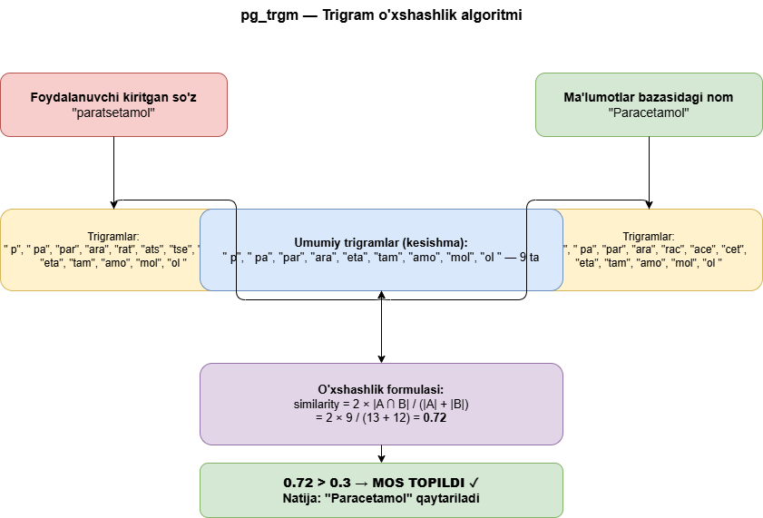
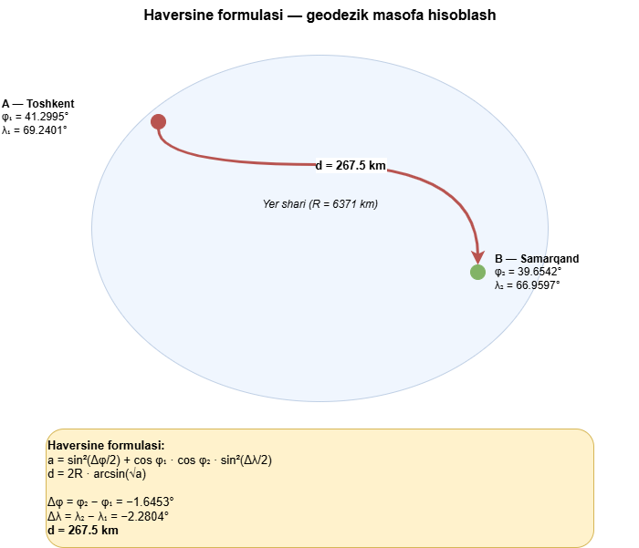

## 1.2. Qidiruv algoritmlari va geodezik masofani hisoblash nazariy asoslari

Zamonaviy multi-pharmacy platformalarning samaradorligi ikki asosiy algoritmik komponent — dori qidiruvi va dorixona ranjirlashiga bog'liq. Foydalanuvchi kerakli dorini tezda topa olishi uchun qidiruv tizimi nafaqat to'g'ri yozilgan nomlarni, balki xato yozilgan, sinonim yoki rus tilidagi nomlarni ham aniqlay olishi zarur. Eng mos dorixonani ko'rsatish uchun esa geografik masofa yoki narx bo'yicha saralash imkoniyati talab etiladi. Ushbu bo'limda mazkur ikki algoritmik yo'nalish — fuzzy qidiruv va Haversine geodezik masofa hisoblash — ning nazariy asoslari batafsil ko'rib chiqiladi.

### Oddiy matn qidiruvining cheklovlari

An'anaviy ma'lumotlar bazasi qidiruvida keng qo'llaniladigan LIKE operatori matn qidiruvining eng oddiy shakli hisoblanadi. Ushbu yondashuvda `WHERE name LIKE '%paracetamol%'` kabi so'rov berilganda, ma'lumotlar bazasi berilgan satrni butunlay o'z ichiga olgan yozuvlarni qaytaradi. Biroq, bu usulning bir qator jiddiy cheklovlari mavjud. Birinchi cheklov — xatolarga bardoshsizlik: foydalanuvchi "paratsetamol" yoki "parasitamol" deb yozsa, LIKE operatori hech qanday natija qaytarmaydi, holbuki bu xatolar odatiy tabiiy til kiritishlaridir. Ikkinchi cheklov — ko'p tillilik muammosi: "Paracetamol" va "Парацетамол" (rus tilidagi yozilishi) o'rtasidagi bogliklikni oddiy LIKE operatori tana olmaydi. Uchinchi cheklov — qisman moslik: foydalanuvchi "No-shpa" deya kiritsa, ma'lumotlar bazasida "No-Spa" sifatida saqlangan yozuv topilmasligi mumkin, chunki katta-kichik harf va defis farqi qidiruvni buzadi. To'rtinchi cheklov — samaradorlik: LIKE operatori GIN yoki GiST indekslaridan foydalana olmaydi va katta jadvallarda to'liq skan (full table scan) qilishga majbur bo'ladi, bu esa ishlash tezligini sezilarli darajada pasaytiradi. Shu sababli zamonaviy qidiruv tizimlari ancha murakkab yondashuvlarni talab etadi.

### Trigram qidiruv va pg_trgm texnologiyasi

Trigram qidiruv — bu matnni uch belgili ketma-ketliklarga (trigramlarga) bo'lib, qidiruv so'rovi va ma'lumotlar bazasidagi yozuvlar o'rtasidagi umumiy trigramlar soniga asoslangan o'xshashlikni hisoblaydigan algoritmdir. PostgreSQL ma'lumotlar bazasida bu imkoniyat `pg_trgm` kengaytmasi orqali ta'minlanadi. Har qanday matn satr uchun trigram to'plami quyidagicha hosil qilinadi: avval satrning boshiga ikki bo'sh joy, oxiriga bir bo'sh joy qo'shiladi, so'ngra har uch ketma-ket belgi alohida trigram sifatida ajratib olinadi. Masalan, "para" so'zi uchun trigramlar: `"  p"`, `" pa"`, `"par"`, `"ara"`, `"ra "` shaklida hosil bo'ladi. Ikki satr o'rtasidagi o'xshashlik quyidagi formula yordamida hisoblanadi: similarity = 2 × |A ∩ B| / (|A| + |B|), bu yerda A va B — mos ravishda birinchi va ikkinchi satrning trigram to'plamlari, |A ∩ B| esa ularning kesishmasidagi trigramlar soni. Natijada 0 dan 1 gacha bo'lgan o'xshashlik koeffitsienti olinadi, bu koeffitsient esa belgilangan chegara qiymatidan (odatda 0.3) yuqori bo'lsa, mos topilgan deb hisoblanadi. `pg_trgm` kengaytmasi GIN va GiST indekslarini qo'llab-quvvatlaydi, bu esa katta jadvallarda ham yuqori qidiruv tezligini ta'minlaydi.

**1.2.1-rasm. pg_trgm trigram o'xshashlik algoritmi.**

### Ko'p bosqichli fuzzy qidiruv yondashuvi

Amaliy tizimlarni loyihalashda faqat trigram qidiruvga tayanish yetarli emas — turli aniqlik darajasidagi mos tushuvlarni to'g'ri tartiblash uchun ko'p bosqichli yondashuv talab etiladi. Men ushbu loyihada besh bosqichli qidiruv algoritmini ishlab chiqdim, bunda har bir bosqich o'ziga xos aniqlik darajasi (score) bilan belgilanadi. Birinchi bosqich — aniq mos (exact match): dori nomi, generik nomi yoki rus tilidagi nomi so'rovga aynan tengsa, `score = 1.0` beriladi va bu eng yuqori ustuvorlik hisoblanadi. Ikkinchi bosqich — qisman mos (ILIKE contains): uchala nom maydoni so'rovni o'z ichiga olsa, `score = 0.7` beriladi — bu qisman kiritilgan so'zlarni (masalan, "para" → "Paracetamol") topish imkonini beradi. Uchinchi bosqich — sinonim qidiruvi: `medicine_synonyms` jadvalida sinonimlar yoki savdo nomlari qidirilib, mos topilsa `score = 0.65` beriladi, bu esa "Panadol" yoki "Tylenol" deb kiritilganda Paracetamolni topish imkonini beradi. To'rtinchi bosqich — trigram o'xshashlik: `pg_trgm` kengaytmasining `similarity()` funksiyasi 0.3 chegaradan yuqori natija bersa, hisoblangan o'xshashlik qiymati bevosita `score` sifatida ishlatiladi. Barcha bosqichlar natijasida topilgan yozuvlar deduplikatsiya qilinib, `score DESC` tartibida saralanadi va faqat `quantity > 0` hamda `is_active = true` shartlarini qondiruvchi dorixonalar ko'rsatiladi.

### Geodezik masofa va Haversine formulasi

Foydalanuvchiga eng yaqin dorixonani aniqlash uchun ikkita geografik nuqta orasidagi haqiqiy masofani hisoblash zarur. Yer shari sifatli emas, ellipsoid shaklida bo'lganligi sababli oddiy Euklidean masofa formulasi aniq natija bermaydi — uzoq masofalar uchun xato sezilarli darajada ortib ketadi. Haversine formulasi esa ushbu muammoni bartaraf etib, ikkita nuqtaning kenglik va uzunlik koordinatalari asosida Yer sferasi yuzasi bo'ylab eng qisqa masofani (geodezik masofa yoki "katta doira masofasi") hisoblaydi. Formula 1984-yilda R.W. Sinnott tomonidan astronomik hisoblar uchun taqdim etilgan bo'lib, keyinchalik GPS navigatsiyasi va geolokatsiya ilovalarida keng tarqalgan. Haversine formulasi quyidagi ko'rinishda ifodalanadi: `a = sin²(Δφ/2) + cos φ₁ · cos φ₂ · sin²(Δλ/2)`, `d = 2R · arcsin(√a)`, bu yerda φ₁ va φ₂ — ikkita nuqtaning kenglik (latitude) qiymatlari, Δφ va Δλ — kenglik va uzunlik farqlari, R = 6371 km esa Yerning o'rtacha radiusi. Masalan, Toshkent (41.2995°N, 69.2401°E) va Samarqand (39.6542°N, 66.9597°E) orasidagi masofa ushbu formula yordamida ~267.5 km deb aniqlanadi, bu esa Google Maps ko'rsatadigan haqiqiy masofa bilan deyarli to'liq mos keladi.

**1.2.2-rasm. Haversine formulasi — geodezik masofa hisoblash.**

### Haversine va Euklidean masofaning taqqoslanishi

Geografik masofani hisoblashda ikkita asosiy yondashuv mavjud: Euklidean (tekislikdagi to'g'ri chiziq) masofa va Haversine (sferik yuzadagi geodezik masofa). Euklidean masofa `d = √((x₂-x₁)² + (y₂-y₁)²)` formulasi bilan hisoblanib, koordinatalar farqi kichik bo'lganda (taxminan 50 km dan kam masofada) yetarlicha aniq natija beradi. Biroq, katta masofalar uchun Yer sferik shakli tufayli Euklidean yondashuv xatolarga olib keladi — masalan, 500 km masofada xato 10-15% ga yetishi mumkin. Haversine formulasi esa Yer sferasining egriligini hisobga olib, istalgan masofada yuqori aniqlikni ta'minlaydi. O'zbekiston miqyosida — mamlakatning eni taxminan 925 km, bo'yi 530 km ekanligi hisobga olinsa — Haversine formulasidan foydalanish zaruriy hisoblanadi, chunki tizim Toshkentdagi foydalanuvchiga Samarqand yoki Farg'onadagi dorixonalarni ham ko'rsatishi mumkin. Shuningdek, Haversine formulasi trigonometrik funksiyalarga asoslanganligi sababli hisoblash murakkabligi jihatidan ham Euklidean formula bilan taxminan teng, biroq aniqlik jihatidan sezilarli darajada ustundir.

### Optimallashtirish mezonlari: masofa va narx

Dorixona ranjirlash tizimida foydalanuvchi ikki xil optimallashtirish mezoni orasida tanlash imkoniga ega bo'ladi. Birinchi mezon — masofaga ko'ra saralash (Distance mode): Haversine formulasi yordamida hisoblangan geodezik masofa asosida dorixonalar o'sish tartibida saralanadi, ya'ni eng yaqin dorixona birinchi o'rinda ko'rsatiladi. Bu rejim tezkor yordam zarur bo'lganda, masalan kechasi yoki favqulodda holatlarda ayniqsa qimmatlidir. Ikkinchi mezon — narxga ko'ra saralash (Price mode): bir xil dorini taklif etuvchi dorixonalar narxi o'sish tartibida saralanadi, ya'ni eng arzon variant birinchi o'rinda ko'rsatiladi. Bu rejim tejamkorlikka ahamiyat beradigan foydalanuvchilar uchun, masalan surunkali kasalliklar uchun dori sotib olayotganlar uchun maqsadga muvofiqdir. Foydalanuvchi qidiruv sahifasidagi toggle (almashtirish tugmasi) yordamida ikkala rejim orasida erkin almasha oladi va natijalar sahifani qayta yuklashsiz darhol qayta tartibladi. Bu yondashuv foydalanuvchiga o'z ehtiyojiga qarab moslashuvchan qaror qabul qilish imkonini beradi.

### O'zbekiston konteksti

O'zbekistonda dori qidiruvining o'ziga xos murakkabligi ko'p tillilik muammosidir. Mamlakatimizdagi dorilar bir vaqtning o'zida bir necha tilda nomlanishi odatiy holdir: o'zbekcha ("Paratsetamol"), ruscha ("Парацетамол"), inglizcha ("Paracetamol") va savdo nomi ("Panadol", "Tylenol"). Bundan tashqari, foydalanuvchilar ko'pincha nomni xato yozadi yoki qisman kiritadi. Shuning uchun O'zbekiston bozori uchun mo'ljallangan dori qidiruv tizimi majburiy ravishda ko'p tillilikni, xato tolerantligini va sinonim qidiruvini qo'llab-quvvatlashi kerak. Aynan shu talablar ko'p bosqichli fuzzy qidiruv algoritmini va `pg_trgm` trigram kengaytmasini tizimning asosiy qidiruv mexanizmi sifatida tanlashga undadi. Geolokatsiya jihatidan esa O'zbekiston shaharlarining kenglik va uzunlik koordinatalari (Toshkent — 41.30°N, Samarqand — 39.65°N, Farg'ona — 40.38°N) orasidagi masofalar Haversine formulasidan foydalanish zarurligini to'la asoslaydi, chunki shaharlararo masofalar yuzlab kilometrni tashkil etadi.

### Xulosa

Shunday qilib, zamonaviy dori qidiruv tizimlari uchun oddiy LIKE qidiruvi yetarli emas — ko'p bosqichli fuzzy qidiruv va `pg_trgm` trigram texnologiyasi xato yozilgan, sinonim yoki ko'p tilli nomlarni ham aniq topish imkonini beradi. Haversine geodezik masofa formulasi esa Euklidean yondashuvga nisbatan yuqori aniqlik bilan eng yaqin dorixonani aniqlaydi va O'zbekiston geografiyasi uchun ayniqsa muhim hisoblanadi. Masofa va narx bo'yicha moslashuvchan saralash imkoniyati foydalanuvchiga o'z vaziyatiga mos optimal yechimni tanlash erkinligini beradi. Keyingi bo'limda ushbu algoritmik yechimlar asosida qurilgan DrugstoreSystem platformasi mavjud analoglar bilan qiyosiy tahlil qilinadi.
