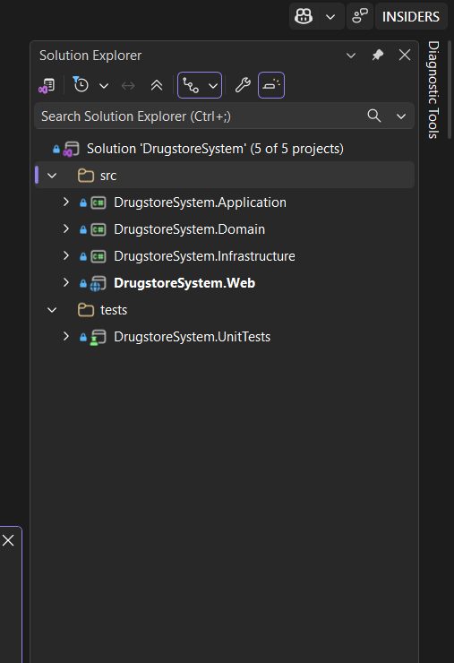
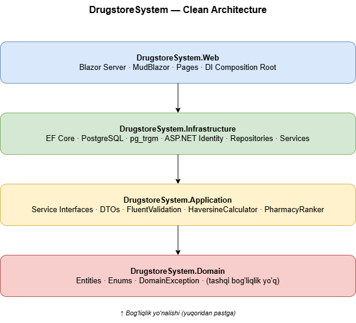
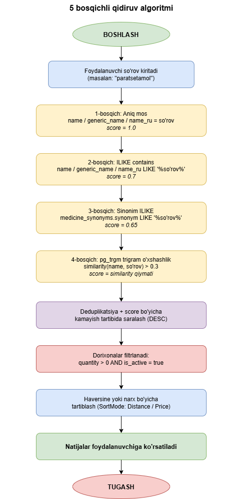

# II BOB. DORIXONA QIDIRUV TIZIMINI LOYIHALASH VA ISHLAB CHIQISH

## 2.1. Tizim arxitekturasi va zaruriy texnologiyalarni tanlash

Zamonaviy dasturiy ta'minot loyihalarini ishlab chiqishda to'g'ri arxitektura tanlash — bu loyihaning uzoq muddatli samaradorligi, qo'llab-quvvatlanishi va kengaytirilishi uchun hal qiluvchi omil hisoblanadi. Ushbu bo'limda men DrugstoreSystem platformasini ishlab chiqishda qo'llagan arxitektura yondashuvi va texnologiyalar to'plami batafsil ko'rib chiqiladi. Har bir texnologiyani tanlashda aniq texnik va amaliy asoslar mavjud bo'lib, ularning barchasi loyihaning muvaffaqiyatli amalga oshirilishiga muhim hissa qo'shgan.

### Clean Architecture — loyiha tuzilmasi

Men ushbu loyihada Clean Architecture (Toza Arxitektura) tamoyilini qo'lladim — bu Robert C. Martin tomonidan taklif etilgan arxitektura yondashuvi bo'lib, tizimni mustaqil qatlamlarga ajratish orqali biznes mantiqini texnik tafsilotlardan ajratib turadi. Loyiha to'rtta asosiy qatlamdan iborat:

**DrugstoreSystem.Domain** — bu eng ichki qatlam bo'lib, biznes sub'ektlari (entities) va domenga oid qoidalarni o'z ichiga oladi. `Medicine`, `Pharmacy`, `PharmacyMedicine`, `MedicineSynonym`, `Category` kabi asosiy sub'ektlar va `SortMode`, `DosageForm` kabi enumlar aynan shu yerda joylashgan. Bu qatlam hech qanday tashqi kutubxonaga bog'liq emas — faqat .NET ning standart kutubxonalaridan foydalanadi.

**DrugstoreSystem.Application** — bu ikkinchi qatlam bo'lib, xizmat interfeyslari, DTOlar, validatorlar va sof biznes mantiqini o'z ichiga oladi. `ISearchService`, `IMedicineService`, `IPharmacyService`, `IInventoryService` kabi interfeyslari va `HaversineCalculator`, `PharmacyRanker` kabi algoritmik sinflar shu yerda joylashgan. Bu qatlam Domain ga bog'liq, biroq Infrastructure dan mutlaqo mustaqil.

**DrugstoreSystem.Infrastructure** — bu uchinchi qatlam bo'lib, tashqi tizimlar bilan ishlash uchun zarur implementatsiyalarni o'z ichiga oladi: Entity Framework Core orqali PostgreSQL bilan ishlash, `SearchRepository` (pg_trgm SQL so'rovlari), `PharmacyRepository`, `MedicineRepository` va `InventoryRepository` kabi konkret implementatsiyalar. ASP.NET Core Identity integratsiyasi ham shu yerda amalga oshirilgan.

**DrugstoreSystem.Web** — bu eng tashqi qatlam bo'lib, Blazor Server asosidagi foydalanuvchi interfeysi va DI (Dependency Injection) ni sozlash uchun kompozitsion ildiz (composition root) vazifasini bajaradi. Barcha Razor komponentlar, sahifalar (`SearchPage`, `MedicineDetail`, `PharmacyDetail`, `Admin/*`, `Pharmacist/*`) va `Program.cs` shu yerda joylashgan.

Ushbu arxitektura yondashuvi bog'liqlik yo'nalishini qat'iy nazorat qiladi: `Web → Infrastructure → Application → Domain`. Bu printsip loyihaning test qilinishi va kelajakda kengaytirilishini sezilarli darajada osonlashtiradi.

**2.1.1-rasm. Loyihaning Solution Explorer ko'rinishi.**

**2.1.2-rasm. DrugstoreSystem Clean Architecture diagrammasi.**

### Frontend — Blazor Server va MudBlazor

Men frontend texnologiyasi sifatida Microsoft ning Blazor Server freymvorkini tanladim. Ushbu tanlovning asosiy sababi — loyihaning barcha qismlarida bir xil dasturlash tilidan (C#) foydalanish imkoniyati bo'lib, bu kod bazasining yaxlitligini saqlaydi va JavaScript kabi qo'shimcha til o'rganish zaruriyatini bartaraf etadi. Blazor Server da komponent kodlari server tomonida ishlaydi va brauzer bilan SignalR protokoli orqali real vaqtda aloqa o'rnatiladi — bu serverdagi resurslardan to'liq foydalanish imkonini beradi. MudBlazor komponent kutubxonasi esa zamonaviy Material Design uslubidagi tayyor UI komponentlar (MudAutocomplete, MudDataGrid, MudStepper, MudToggleGroup va boshqalar) to'plamini taqdim etadi, bu esa interfeys ishlab chiqish vaqtini sezilarli darajada qisqartirdi.

### Backend — ASP.NET Core 10

Tizimning server tomoni ASP.NET Core 10.0 freymvorki asosida qurilgan. ASP.NET Core — bu Microsoft tomonidan ishlab chiqilgan yuqori samarali, ko'p platformali veb-freymvork bo'lib, o'rta dasturiy qatlam (middleware), dependency injection va marshrutlash (routing) mexanizmlarini o'z ichiga oladi. Blazor Server freymvorki ASP.NET Core ning ustida ishlashi sababli, backend uchun alohida API serveri kerak bo'lmadi — bu arxitekturani soddalashtirdi va tizimni bitta loyiha sifatida boshqarish imkonini berdi. Autentifikatsiya uchun cookie-based sessiya (`LoginPath = "/auth/login"`) qo'llanildi.

### C# va .NET 10.0

C# — bu Microsoft tomonidan yaratilgan kuchli tipli, ob'ektga yo'naltirilgan dasturlash tili bo'lib, enterprise darajasidagi ilovalar ishlab chiqishda keng qo'llaniladi. .NET 10.0 platformasining so'nggi versiyasi sifatida yangi til xususiyatlari, yaxshilangan ishlash ko'rsatkichlari va kengaytirilgan standart kutubxona imkoniyatlarini taqdim etadi. Men C# ni tanladim, chunki bu til katta ekotizimga, mukammal hujjatlashtirishga ega va O'zbekistondagi IT sohasida ham keng qo'llaniladi.

### ORM — Entity Framework Core 10

Ma'lumotlar bazasi bilan ishlash uchun men Entity Framework Core 10 dan foydalandim. EF Core — bu .NET uchun eng keng tarqalgan ORM (Object-Relational Mapper) bo'lib, C# ob'ektlari bilan PostgreSQL jadvallari o'rtasidagi ko'prikni ta'minlaydi. Code-First yondashuvi orqali men avval C# da domenlik sub'ektlarini yozdim, so'ngra EF Core migrations mexanizmi yordamida ma'lumotlar bazasi jadvallarini avtomatik yaratdim. `UseSnakeCaseNamingConvention()` sozlamasi orqali jadval va ustun nomlarini PostgreSQL uchun qulay `snake_case` formatiga o'tkazdim.

### Ma'lumotlar bazasi — PostgreSQL 16 va pg_trgm

Ma'lumotlar bazasi menejment tizimi sifatida men PostgreSQL 16 ni tanladim — va bu tanlov birinchi navbatda `pg_trgm` kengaytmasi bilan bog'liq. `pg_trgm` — PostgreSQL ning trigram o'xshashlik qidiruvi uchun mo'ljallangan rasmiy kengaytmasi bo'lib, GIN indekslash orqali katta jadvallarda ham yuqori tezlikda fuzzy qidiruv imkoniyatini beradi. MySQL, SQLite kabi alternativlar bunday built-in trigram qidiruv imkoniyatiga ega emas. Bundan tashqari, PostgreSQL ochiq kodli, bepul, yuqori samarali va kuchli community tomonidan qo'llab-quvvatlangan — bu uni ushbu loyiha uchun optimal tanlov qildi.

### Autentifikatsiya — ASP.NET Core Identity

Foydalanuvchi autentifikatsiyasi uchun ASP.NET Core Identity tizimi qo'llanildi. Bu Microsoft ning standart autentifikatsiya freymvorki bo'lib, foydalanuvchi hisob qaydnomalarini boshqarish, parol xeshlash, cookie asosidagi sessiya boshqaruvi kabi funksiyalarni taqdim etadi. Tizimda ikkita rol ko'zda tutilgan: `Admin` va `Pharmacist`. Har bir farmatsevt hisob qaydnomasi bitta dorixonaga bog'langan (`PharmacyId` claim orqali), bu esa farmatsevtning faqat o'z dorixonasi inventarini ko'ra olishini kafolatlaydi.

### Logging — Serilog

Tizim ishini kuzatish uchun Serilog kutubxonasidan foydalanildi. Serilog — bu .NET uchun tuzilmali (structured) logging freymvorki bo'lib, log yozuvlarini konsolga va aylanuvchi fayllarga bir vaqtda yozish imkoniyatini beradi. Qidiruv so'rovlari, baholash natijalari va xatolar haqidagi ma'lumotlar `logs/drugstore-YYYYMMDD.log` faylida saqlanadi.

### Validatsiya — FluentValidation

Foydalanuvchi kiritgan ma'lumotlarni tekshirish uchun FluentValidation kutubxonasidan foydalanildi. `CreatePharmacyRequestValidator`, `UpdatePharmacyRequestValidator` kabi validatsiya sinflari o'zbek tilidagi xato xabarlari bilan forma maydonlarini himoya qiladi.

**2.1.4-rasm. Qidiruv algoritmi oqimi diagrammasi.**

### Xulosa

Shunday qilib, men ushbu loyihada zamonaviy va sanoat standartlariga mos texnologiyalar to'plamini tanladim. Clean Architecture tamoyili loyihaning qatlamli tuzilmasini ta'minlasa, Blazor Server va MudBlazor qulay foydalanuvchi interfeysini, EF Core va PostgreSQL ishonchli ma'lumotlar saqlashni, pg_trgm kengaytmasi esa fuzzy qidiruv algoritmini ta'minlaydi. Ushbu texnologiyalar kombinatsiyasi O'zbekiston farmatsevtika bozori uchun moslashtirilgan, zamonaviy va kengaytirilishi mumkin bo'lgan platforma yaratish imkonini berdi. Keyingi bo'limda ushbu texnologiyalar asosida qurilgan ma'lumotlar bazasi modeli batafsil ko'rib chiqiladi.
