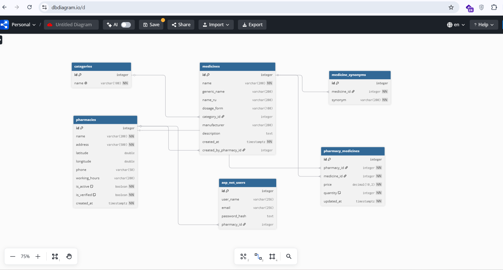
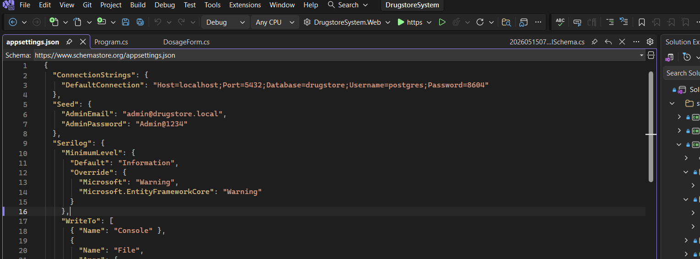
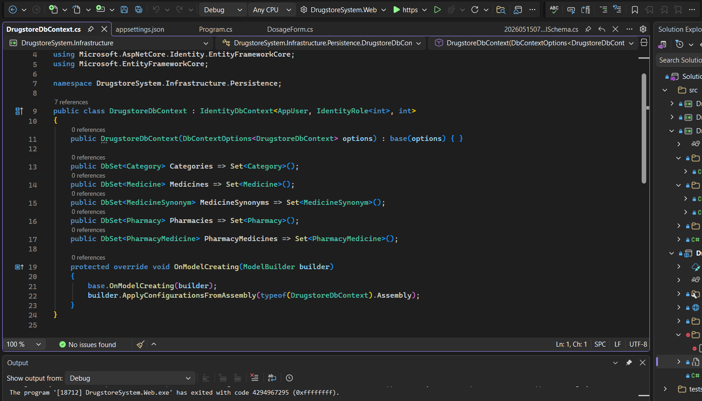
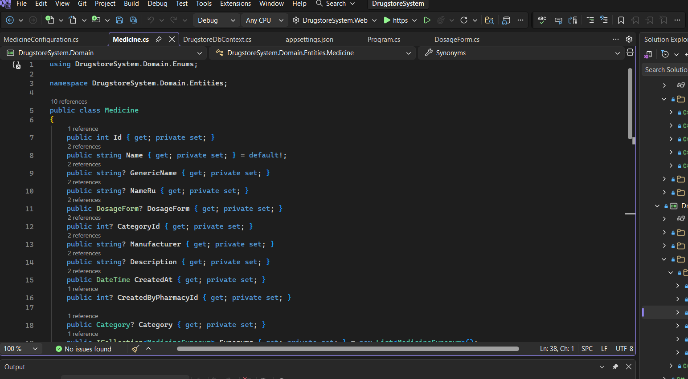
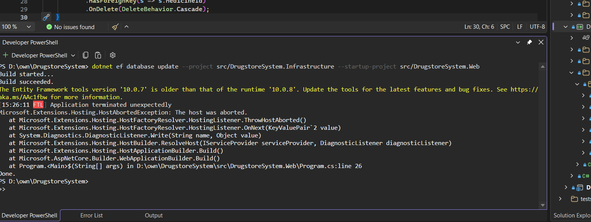

## 2.2. Ma'lumotlar bazasini loyihalash va integratsiyalash

Ma'lumotlar bazasi — bu har qanday axborot tizimining asosi bo'lib, u tizim saqlashi, qayta ishlashi va taqdim etishi kerak bo'lgan barcha ma'lumotlarni tashkil etadi. DrugstoreSystem platformasida dorixonalar, dorilar, inventar va foydalanuvchilar haqidagi ko'p qirrali ma'lumotlarni samarali saqlash va tez qidirish uchun puxta loyihalashtirilgan ma'lumotlar bazasi muhim ahamiyatga ega. Ushbu bo'limda men qo'llagan Code-First yondashuvidan tortib, har bir jadvalning maqsadi, ular orasidagi munosabatlar va pg_trgm indekslargacha batafsil ko'rib chiqiladi.

### Code-First yondashuvi

Men ma'lumotlar bazasini loyihalashda Code-First yondashuvini qo'lladim, ya'ni avval C# da domenlik sub'ektlarini yozdim, so'ngra Entity Framework Core ning migrations mexanizmi yordamida PostgreSQL jadvallari avtomatik yaratildi. Bu yondashuv bir qator muhim afzalliklarga ega: birinchidan, ma'lumotlar modeli kod sifatida versiya nazorati ostida (git) saqlanadi; ikkinchidan, model o'zgarishlarini migrations orqali ketma-ket kuzatib borish mumkin; uchinchidan, `dotnet ef database update` buyrug'i yordamida migrations ni istalgan muhitga qo'llash mumkin. `IEntityTypeConfiguration<T>` interfeysi orqali har bir sub'ekt uchun alohida konfiguratsiya sinflari yozildi — bu `DbContext` faylini toza saqlash imkonini berdi.



**2.2.1-rasm. DrugstoreSystem ER diagrammasi.**

### PostgreSQL va pg_trgm sozlamalari

Ma'lumotlar bazasi tizimi sifatida PostgreSQL 16 tanlangan bo'lib, uning asosiy sababi `pg_trgm` kengaytmasini qo'llab-quvvatlashidir. Initial migration da quyidagi SQL buyruq bajariladi: `CREATE EXTENSION IF NOT EXISTS pg_trgm;` — bu buyruq trigram qidiruv funksiyalari va GIN indekslarini faollashtiradi. Bundan tashqari, `EFCore.NamingConventions` paketi orqali `UseSnakeCaseNamingConvention()` qo'llanib, barcha jadval va ustun nomlar avtomatik `snake_case` formatiga o'tkazildi: masalan, `PharmacyMedicine` → `pharmacy_medicines`, `CreatedAt` → `created_at`.



**2.2.2-rasm. Ulanish satri konfiguratsiyasi.**

### Asosiy jadvallar tavsifi

**categories jadvali** — dori kategoriyalarini saqlaydi: `id` (birlamchi kalit), `name` (kategoriya nomi, UNIQUE). Seed ma'lumotlari: Analgetik, Antibiotik, Antivirusli, Kardio, Enterosorbent, Vitamini, Spazmolitik, Ko'z tomchilari, Tashqi va Boshqa.

**medicines jadvali** — bu tizimning markaziy shared catalog jadvali bo'lib, barcha farmatsevtlar tomonidan birgalikda to'ldiriladi. Maydonlar: `id`, `name` (dori tijorat nomi), `generic_name` (generik, xalqaro nomi), `name_ru` (rus tilidagi nomi), `dosage_form` (dori shakli: Tablet, Capsule, Syrup va boshqalar), `category_id` (kategoriya FK), `manufacturer`, `description`, `created_at`, `created_by_pharmacy_id` (birinchi qo'shgan dorixona FK). Ushbu jadvalda fuzzy qidiruv uchun GIN indekslari quyidagicha yaratiladi:

```sql
CREATE INDEX ix_medicines_name_trgm ON medicines USING GIN (name gin_trgm_ops);
CREATE INDEX ix_medicines_generic_name_trgm ON medicines USING GIN (generic_name gin_trgm_ops);
CREATE INDEX ix_medicines_name_ru_trgm ON medicines USING GIN (name_ru gin_trgm_ops);
```

**medicine_synonyms jadvali** — dorining sinonim va savdo nomlarini saqlaydi: `id`, `medicine_id` (FK → medicines, CASCADE DELETE), `synonym`. Masalan, Paracetamol uchun: "Panadol", "Tylenol", "Para-500". Bu jadvalda ham GIN indeks qo'yilgan:

```sql
CREATE INDEX ix_medicine_synonyms_trgm ON medicine_synonyms USING GIN (synonym gin_trgm_ops);
```

**pharmacies jadvali** — platformadagi dorixonalar haqidagi asosiy ma'lumotlarni saqlaydi: `id`, `name`, `address`, `latitude`, `longitude` (Haversine hisoblash uchun), `phone`, `working_hours`, `is_active`, `is_verified`, `created_at`. Faol dorixonalar uchun qisman indeks qo'yilgan: `CREATE INDEX ix_pharmacies_active ON pharmacies (is_active) WHERE is_active = true`.

**pharmacy_medicines jadvali** — bu inventar jadvali bo'lib, har bir dorixona-dori juftligi uchun narx va miqdorni saqlaydi: `id`, `pharmacy_id` (FK → pharmacies, CASCADE), `medicine_id` (FK → medicines, CASCADE), `price` (so'mda), `quantity` (dona), `updated_at`. Juftlik UNIQUE cheklov bilan himoyalangan: `UNIQUE (pharmacy_id, medicine_id)`. Qidiruv uchun qisman indeks: `CREATE INDEX ix_pm_medicine_available ON pharmacy_medicines (medicine_id, price) WHERE quantity > 0`.

**asp_net_users jadvali** — ASP.NET Core Identity ning standart foydalanuvchi jadvali bo'lib, qo'shimcha `pharmacy_id` (FK → pharmacies) maydoni bilan kengaytirilgan. Admin uchun bu maydon NULL, Farmatsevt uchun esa tegishli dorixona ID si saqlanadi.



**2.2.3-rasm. DrugstoreDbContext sinfi.**



**2.2.4-rasm. Medicine entity va konfiguratsiya sinfi.**

### Ma'lumotlar munosabatlari

Jadvallar orasidagi munosabatlar quyidagicha: `Category` → `Medicine` orasida bir-ko'p (one-to-many, ixtiyoriy) munosabat mavjud. `Medicine` → `MedicineSynonym` orasida bir-ko'p munosabat bo'lib, Medicine o'chirilganda sinonimlar ham kaskad o'chiriladi. `Pharmacy` → `PharmacyMedicine` va `Medicine` → `PharmacyMedicine` orasida ham bir-ko'p munosabatlar mavjud — bu ikkisi birgalikda `Pharmacy` va `Medicine` o'rtasida ko'p-ko'p (many-to-many) munosabatni ifodalaydi. `Pharmacy` → `AppUser` o'rtasida bir-bir (one-to-one, ixtiyoriy) munosabat mavjud bo'lib, bir dorixonaga bitta farmatsevt hisob qaydnomasi to'g'ri keladi.

### Shared Catalog pattern

DrugstoreSystem ning asosiy arxitekturaviy xususiyatlaridan biri — shared catalog yondashuvi. An'anaviy tizimlarda har bir dorixona o'z dori ro'yxatini mustaqil yuritadi, bu esa bir xil dorining yuzlab turli nomda va turli imlo xatolar bilan kiritilishiga olib keladi. Shared catalog yondashuvida `medicines` jadvali barcha farmatsevtlar tomonidan birgalikda to'ldiriladi. Pharmacist inventariga dori qo'shayotganda `MudAutocomplete` orqali avval mavjud katalogdan qidiradi; agar dori mavjud bo'lsa, uni tanlab `pharmacy_medicines` ga qo'shadi; agar mavjud bo'lmasa, yangi `Medicine` yozuvi yaratib, shundan so'ng inventarga qo'shadi. Bu crowdsourcing tamoyili vaqt o'tishi bilan katalogning o'z-o'zidan boyib borishini ta'minlaydi.

### Seed ma'lumotlari

Tizimni birinchi marta ishga tushirganda demo ma'lumotlar bilan to'ldirish uchun `DatabaseSeeder` sinfi qo'llaniladi. Bu sinf JSON fayllardan 8 ta dorixona (Toshkent, Samarqand, Farg'ona shaharlarida joylashgan), 30 ta dori (sinonimlar bilan) va ~120 ta inventar yozuvini ma'lumotlar bazasiga yozadi. Seeder idempotent — `if (await context.Pharmacies.AnyAsync()) return;` sharti orqali ma'lumotlar bazasida dorixonalar mavjud bo'lsa, seeder ishlamaydi.

### Migration natijasi

`dotnet ef migrations add 01_InitialSchema` va `dotnet ef database update` buyruqlari bajarilgandan so'ng PostgreSQL da quyidagi jadvallar yaratiladi: `categories`, `medicines`, `medicine_synonyms`, `pharmacies`, `pharmacy_medicines`, barcha ASP.NET Identity jadvallari (`asp_net_users`, `asp_net_roles` va boshqalar). GIN indekslar va `pg_trgm` kengaytmasi ham migrationda avtomatik o'rnatiladi.



**2.2.6-rasm. Migration terminal natijasi.**

### Ma'lumotlar xavfsizligi

Tizimda ma'lumotlar xavfsizligini ta'minlash uchun bir qator choralar ko'rilgan. Foydalanuvchi parollari ASP.NET Core Identity tomonidan avtomatik xeshlanadi — parollar hech qachon ochiq matn sifatida saqlanmaydi. PostgreSQL ulanish satri (connection string) `dotnet user-secrets` orqali saqlansa, demo muhitda esa muhit o'zgaruvchilari orqali beriladi — bu ma'lumotlar git repozitoriyasiga tushib qolishini oldini oladi. Farmatsevt foydalanuvchilari o'z dorixonalari inventaridangina foydalana oladi, chunki `PharmacyId` claim si har bir so'rovda tekshiriladi.

### Xulosa

Shunday qilib, men DrugstoreSystem uchun to'liq relatsion ma'lumotlar bazasi modelini loyihaladim va amalga oshirdim. Code-First yondashuvi, EF Core migrations va PostgreSQL kombinatsiyasi ma'lumotlarni ishonchli saqlash va versiyalangan boshqaruvni ta'minlaydi. pg_trgm GIN indekslari katta jadvallarda ham yuqori qidiruv tezligini kafolatlaydi. Shared catalog arxitekturasi farmatsevtlar hamkorligini rag'batlantiradi va ma'lumotlar bazasini vaqt o'tishi bilan avtomatik boyitadi. Keyingi bobda ushbu ma'lumotlar bazasi asosida qurilgan tizimning amaliy imkoniyatlari ko'rsatib beriladi.
