# III BOB. LOYIHANING AMALIY TATBIQI VA ALGORITMLARINING SAMARADORLIGI

## 3.1. Tizim imkoniyatlari bilan tanishish

Ushbu bob DrugstoreSystem platformasining amaliy tatbiqini va foydalanuvchi nuqtai nazaridan ko'rinadigan barcha imkoniyatlarini to'liq yoritishga bag'ishlangan. Men ishlab chiqqan tizim uch xil foydalanuvchi rolini qo'llab-quvvatlaydi: admin (dorixonalarni ro'yxatdan o'tkazadi va boshqaradi), farmatsevt (o'z dorixonasining inventarini yuritadi) va mehmon foydalanuvchi (login talab qilinmaydi, faqat qidiradi). Quyida tizimning asosiy funksiyalari real skrinshotlar bilan birga batafsil ko'rib chiqiladi.

### Autentifikatsiya va tizimga kirish

Tizimga kirish jarayoni `/auth/login` sahifasidan boshlanadi. Admin va farmatsevtlar elektron pochta manzili va parolini kiritib, tizimga kiradi. Autentifikatsiya muvaffaqiyatli bo'lgach, brauzerda xavfsiz cookie saqlanadi va foydalanuvchi o'z roliga mos dashboard ga yo'naltiriladi: admin `/admin/dashboard` ga, farmatsevt `/pharmacist/dashboard` ga. Noto'g'ri ma'lumotlar kiritilganda o'zbek tilidagi aniq xabar ko'rsatiladi. Mehmon foydalanuvchilar uchun login umuman talab qilinmaydi — ular bevosita bosh sahifaga kirib qidirishni boshlashlari mumkin.

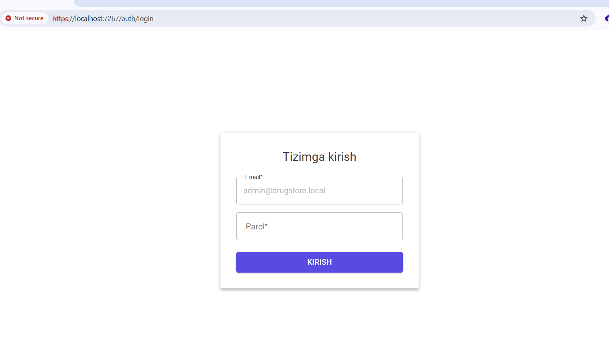

**3.1.1-rasm. Tizimga kirish sahifasi.**

### Admin paneli — Dashboard

Admin tizimga kirganidan so'ng `/admin/dashboard` sahifasiga yo'naltiriladi. Dashboard to'rtta statistik kartochkani ko'rsatadi: jami dorixonalar soni, faol dorixonalar soni, jami dorilar soni (shared catalog hajmi) va jami inventar yozuvlari soni. Ushbu ko'rsatkichlar admin ga platformaning umumiy holatini bir nazar bilan baholash imkonini beradi. Chap tomondagi navigatsiya menyusida "Dorixonalar ro'yxati" va "Yangi dorixona" havolalari joylashgan.

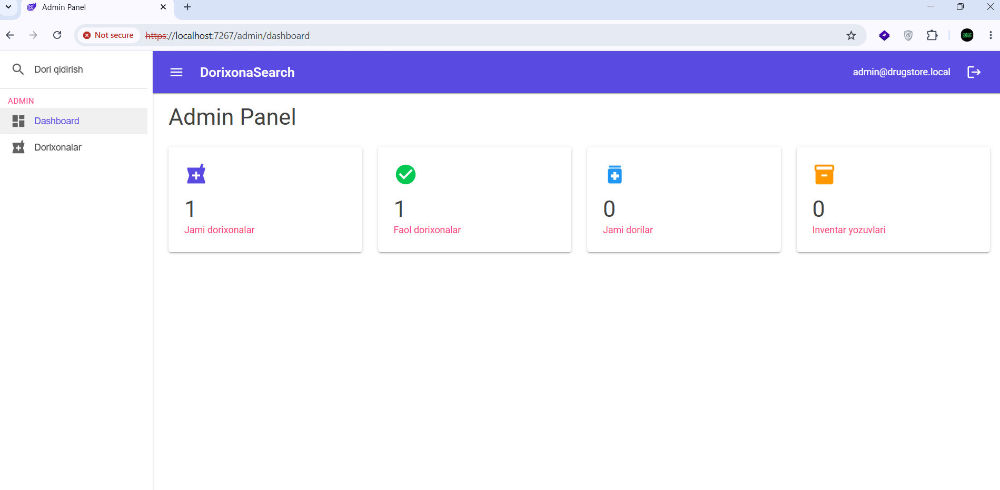

**3.1.2-rasm. Admin dashboard.**

### Admin paneli — Dorixona boshqaruvi

`/admin/pharmacies` sahifasida platformadagi barcha dorixonalar jadval ko'rinishida ko'rsatiladi. Jadvalda har bir dorixona uchun nomi, manzili, telefoni, faol/nofaol holati (toggle orqali o'zgartirish mumkin) va tahrirlash/o'chirish tugmalari ko'rsatiladi. Nofaol qilingan dorixona qidiruv natijalarida ko'rinmaydi — bu inventar yangilanmagan yoki vaqtincha yopilgan dorixonalarni boshqarish imkonini beradi.

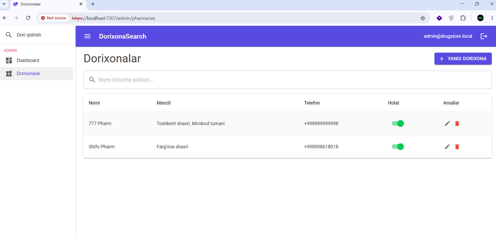

**3.1.3-rasm. Dorixonalar ro'yxati.**

### Yangi dorixona qo'shish

`/admin/pharmacies/create` sahifasida MudStepper komponenti yordamida ikki bosqichli forma amalga oshirilgan. Birinchi bosqichda dorixona ma'lumotlari kiritiladi: nomi, manzili, kenglik va uzunlik koordinatalari, telefoni va ish vaqti. Ikkinchi bosqichda farmatsevt hisob qaydnomasi yaratiladi: elektron pochta va parol. Ikkala bosqich muvaffaqiyatli tugagach, tizim dorixona va farmatsevt hisob qaydnomasini atomik ravishda yaratadi — bitta tranzaksiya doirasida. Farmatsevt darhol o'z elektron pochta va paroli bilan tizimga kira oladi.

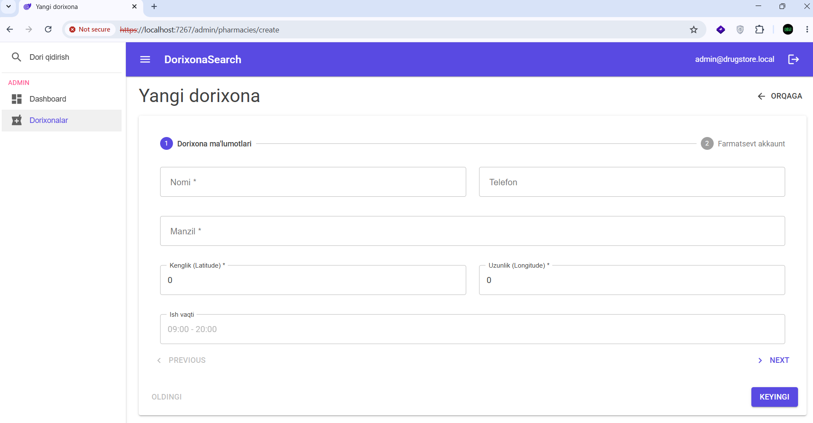

**3.1.4-rasm. Yangi dorixona yaratish formasi.**

### Farmatsevt paneli — Profil tahrirlash

Farmatsevt tizimga kirgandan so'ng `/pharmacist/profile` sahifasida o'z dorixonasining ma'lumotlarini tahrirlash imkoniga ega bo'ladi. Forma nomi, manzili, koordinatalar, telefon va ish vaqtini o'zgartirish imkonini beradi. Koordinatalarni to'g'ri kiritish muhim — chunki ular Haversine algoritmi tomonidan masofani hisoblashda ishlatiladi. Saqlash tugmasi bosilganda FluentValidation orqali ma'lumotlar tekshiriladi va o'zgarishlar darhol kuchga kiradi.

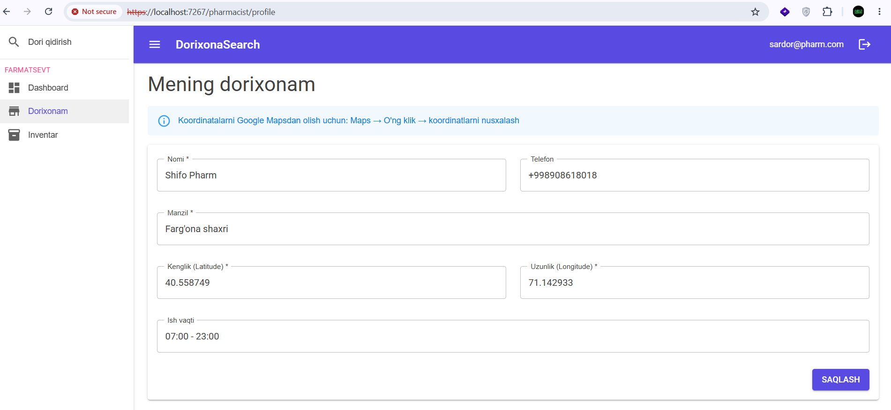

**3.1.5-rasm. Farmatsevt profil tahrirlash sahifasi.**

### Farmatsevt paneli — Inventar boshqaruvi

`/pharmacist/inventory` sahifasida farmatsevt o'z dorixonasidagi barcha dorilarni ko'radi. Jadvalda dori nomi, generik nomi, narxi, miqdori va oxirgi yangilanish sanasi ko'rsatiladi. Narx va miqdor inline tahrirlash (inline edit) orqali to'g'ridan-to'g'ri jadvalda o'zgartirilishi mumkin — alohida sahifaga o'tish talab qilinmaydi. Miqdori 10 tadan kam bo'lgan dorilar uchun sariq "kam" belgisi ko'rsatiladi, bu esa farmatsevtga o'z vaqtida inventarni to'ldirish imkonini beradi.

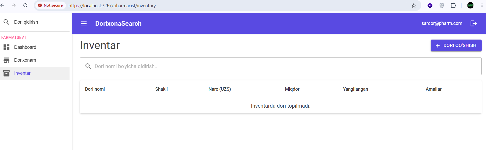

**3.1.6-rasm. Inventar boshqaruvi sahifasi.**

### Inventarga yangi dori qo'shish — Autocomplete oqimi

`/pharmacist/inventory/add` sahifasida `MudAutocomplete` komponenti orqali dori qo'shish amalga oshiriladi. Farmatsevt dori nomining bir qismini yozishi bilanoq (300ms debounce), shared catalog dan mos keluvchi dorlar ro'yxati ko'rsatiladi. Farmatsevt mavjud dorini tanlab, narx va miqdorni kiritib saqlashi mumkin. Agar kerakli dori katalogda topilmasa, "Yangi dori yaratish" kengaytma paneli ochiladi — bu yerda yangi dorining to'liq ma'lumotlari kiritiladi va u barcha farmatsevtlar uchun umumiy katalogga qo'shiladi.

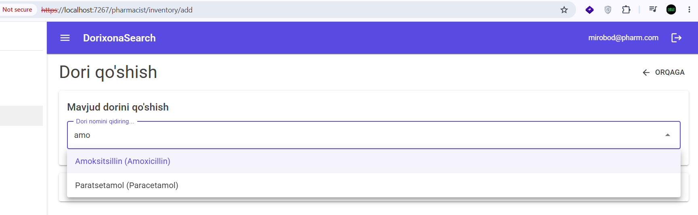

**3.1.7-rasm. Dori autocomplete dropdown.**

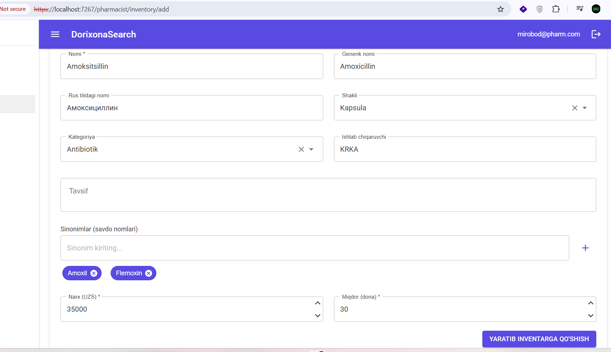

**3.1.8-rasm. Yangi dori yaratish formasi.**

### Jamoat qidiruvi — Bosh sahifa

`/` sahifasi mehmon foydalanuvchilar uchun asosiy qidiruv sahifasi hisoblanadi. Login talab qilinmaydi. Sahifada katta qidiruv maydoni, joylashuv satri ("Shahar nomi (masalan: Farg'ona)") va ikkita saralash tugmasi ("YAQINLIK" va "NARX") joylashgan. Sahifa yuklanganda brauzer geolokatsiya ruxsati so'raydi — agar ruxsat berilsa, foydalanuvchining haqiqiy koordinatalari ishlatiladi; agar rad etilsa yoki joylashuv satriga shahar nomi yozilsa, Nominatim geocoding API orqali koordinatalar aniqlanadi.

### Qidiruv natijalari

Foydalanuvchi dori nomini yozib "QIDIRISH" tugmasini bosgach, 5 bosqichli fuzzy qidiruv algoritmi ishga tushadi. Natijalar expansion panel ko'rinishida ko'rsatiladi: har bir dori uchun alohida panel ochiladi, panel ichida esa o'sha dorini stokida bor dorixonalar jadvali ko'rsatiladi. Jadvalda dorixona nomi va manzili (havolalar sifatida), narxi, miqdori, masofasi (km da) va ish vaqti ko'rsatiladi. "YAQINLIK" rejimida dorixonalar masofaga ko'ra, "NARX" rejimida esa narxga ko'ra saralanadi.

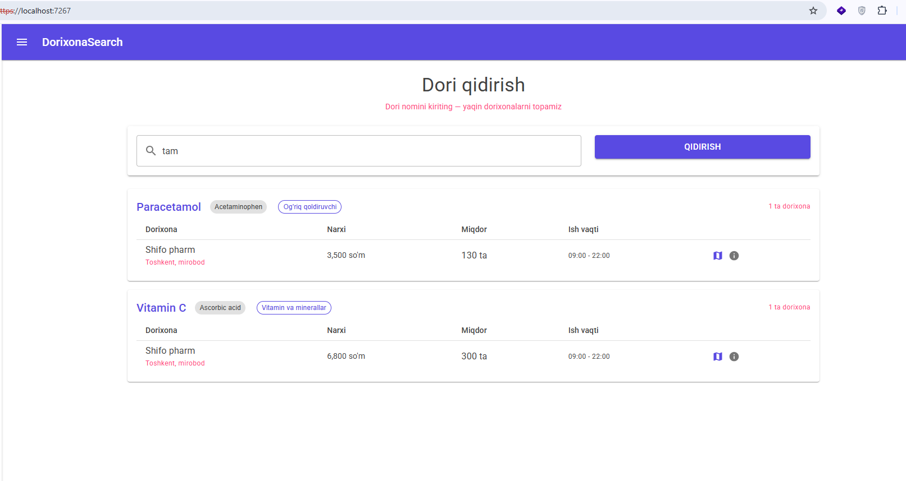

**3.1.9-rasm. Qidiruv natijalari sahifasi.**

### Dori detail sahifasi

Dori nomi bosilganda `/medicine/{id}` sahifasiga o'tiladi. Bu sahifada dorining to'liq ma'lumotlari ko'rsatiladi: nomi, generik nomi, rus tilidagi nomi, shakli (Tabletka, Kapsul va boshqalar), kategoriyasi, ishlab chiqaruvchisi, tavsifi va sinonim savdo nomlari (chip ko'rinishida). O'ng tomonda ushbu dorini sotayotgan faol dorixonalar ro'yxati ko'rsatiladi — faqat `quantity > 0` va `is_active = true` shartlarini qondiruvchilar.

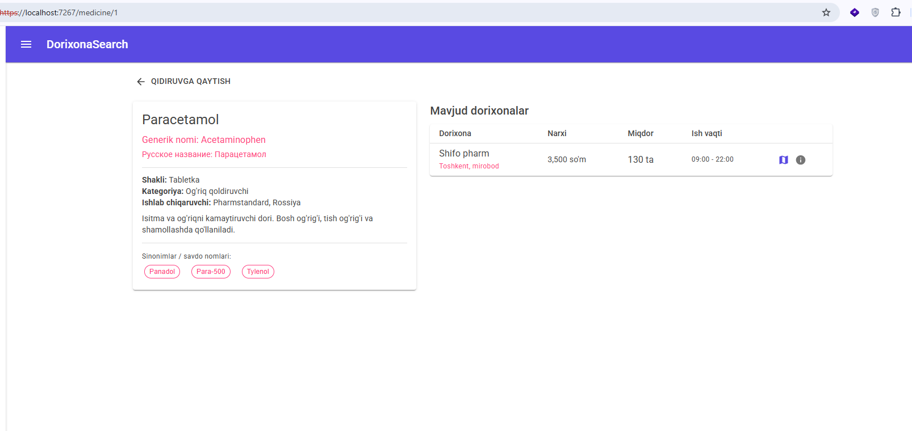

**3.1.10-rasm. Dori detail sahifasi.**

### Dorixona detail sahifasi

Dorixona nomi bosilganda `/pharmacy/{id}` sahifasiga o'tiladi. Bu sahifada dorixonaning to'liq ma'lumotlari ko'rsatiladi: nomi, manzili, telefoni, ish vaqti va faollik holati. "XARITADA KO'RISH" tugmasi bosilganda Google Maps qidiruv sahifasi `https://www.google.com/maps/search/?api=1&query={lat},{lng}` URL manzili bilan yangi tabda ochiladi. O'ng tomonda dorixonadagi barcha mavjud dorilar ro'yxati ko'rsatiladi — har bir dori nomi havolalar sifatida formatlangan.

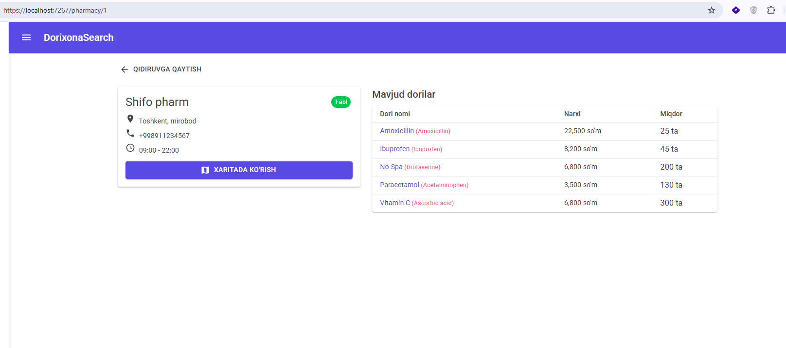

**3.1.11-rasm. Dorixona detail sahifasi.**

### Xulosa

Shunday qilib, DrugstoreSystem platformasi uch xil foydalanuvchi rolini qamrab oluvchi to'liq funksional tizim sifatida amalga oshirilgan. Admin dorixonalarni ro'yxatdan o'tkazish va boshqarishni, farmatsevt inventarni yuritish va umumiy katalogni boyitishni, mehmon foydalanuvchi esa login talab qilinmaydi holda dori qidirishni amalga oshira oladi. Har bir funksiya o'zbek tilidagi interfeys bilan ta'minlangan va real demo ma'lumotlar bilan sinovdan o'tkazilgan. Keyingi bo'limda tizimning asosiy algoritmik komponentlari — fuzzy qidiruv va Haversine optimallashtirish — ning samaradorligi miqdoriy ko'rsatkichlar bilan tahlil qilinadi.
