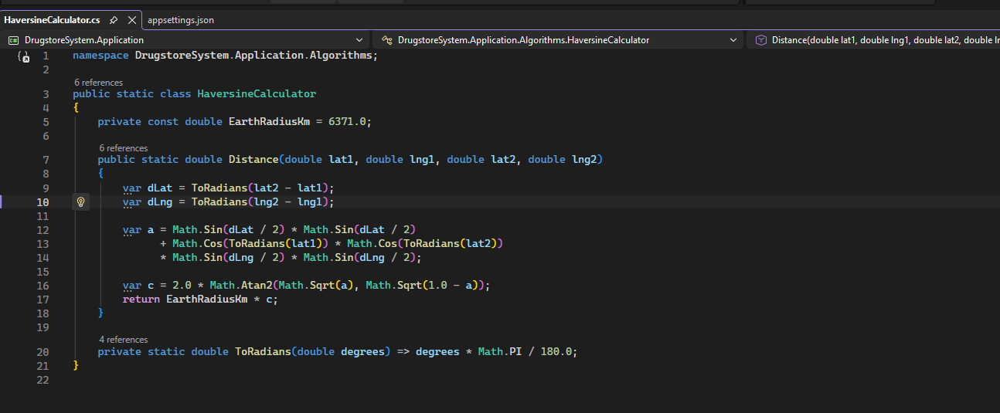
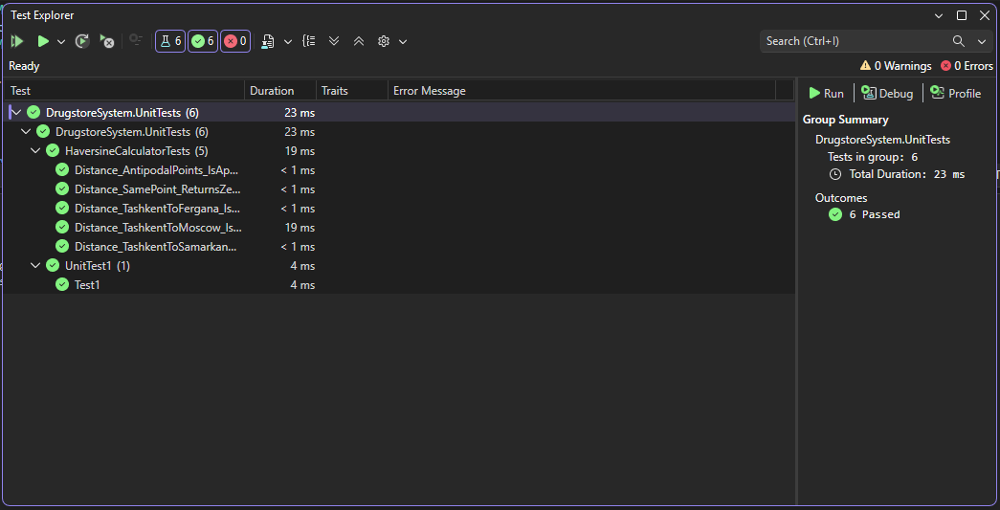
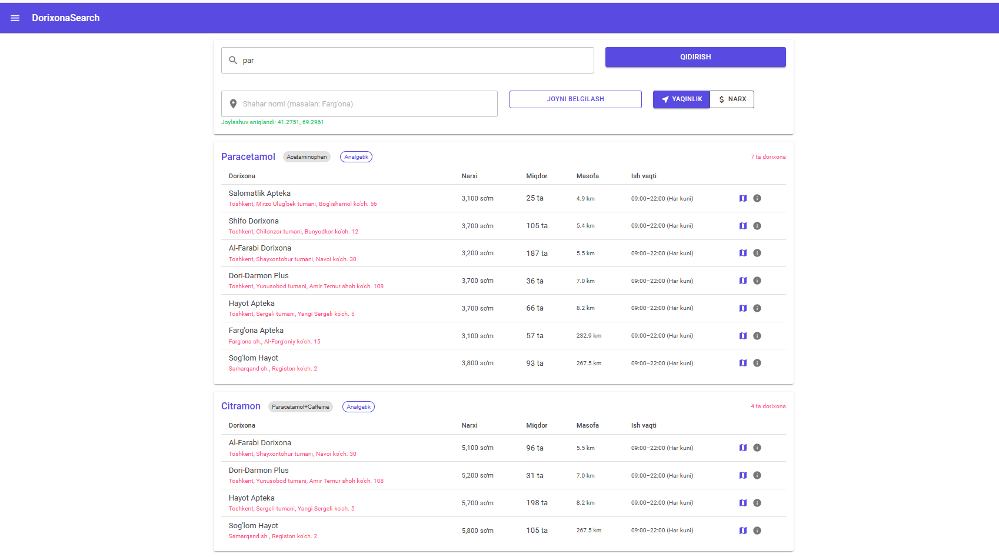
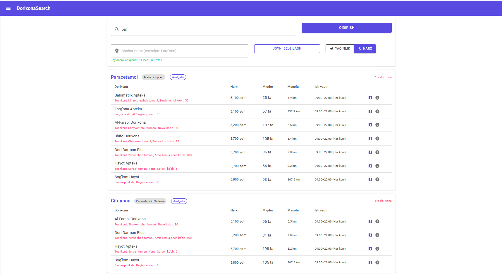
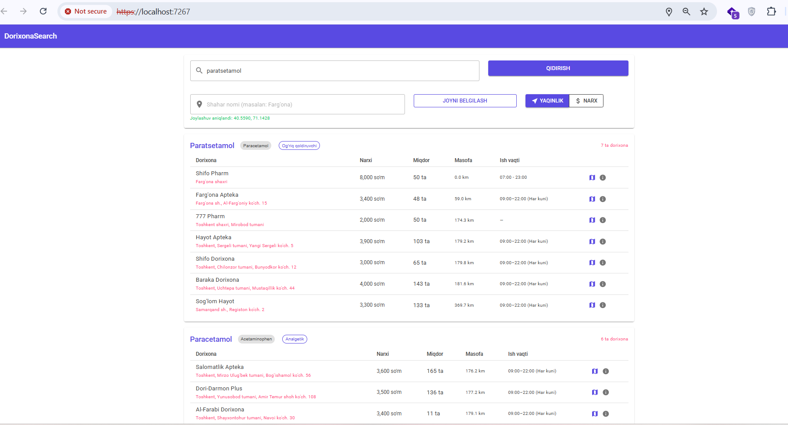
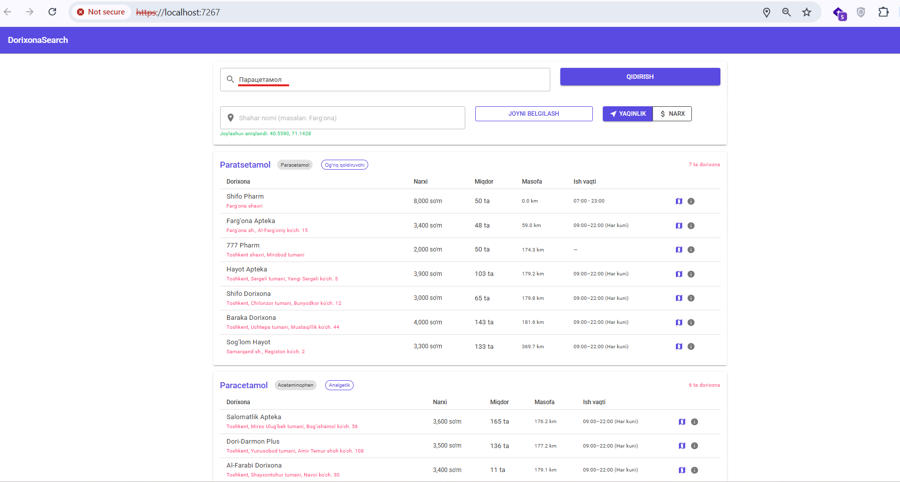

## 3.2. Qidiruv va optimallashtirish algoritmlarining samaradorligi

Ushbu bo'lim DrugstoreSystem platformasining ikki asosiy algoritmik komponentini — 5 bosqichli fuzzy qidiruv algoritmi va Haversine geodezik masofa hisoblash modulini — amaliy sinovlar natijasida baholashga bag'ishlangan. Algoritmlarning samaradorligini isbotlash ushbu bitiruv malakaviy ishining asosiy akademik maqsadi hisoblanadi, chunki aynan ushbu ikki algoritm mavjud analoglardan DrugstoreSystem ni sifat jihatidan ajratib turadi.

### 5 bosqichli qidiruv algoritmining implementatsiyasi

Men `SearchRepository.FindMedicinesAsync` metodida PostgreSQL ning `pg_trgm` kengaytmasidan foydalangan holda 5 bosqichli qidiruv algoritmini bitta SQL so'rov ichida amalga oshirdim. So'rovning asosiy g'oyasi — har bir dori yozuvi uchun uning qidirish so'rov bilan qanchalik mosligini ifodalovchi `score` qiymatini hisoblash va natijalarni shu qiymat bo'yicha saralash. SQL so'rovning asosiy qismi quyidagicha:

```sql
SELECT m.id, m.name, m.generic_name, m.name_ru,
  CASE
    WHEN LOWER(m.name) = :q OR LOWER(m.generic_name) = :q
      OR LOWER(m.name_ru) = :q THEN 1.0
    WHEN LOWER(m.name) LIKE '%'||:q||'%'
      OR LOWER(m.generic_name) LIKE '%'||:q||'%'
      OR LOWER(m.name_ru) LIKE '%'||:q||'%' THEN 0.7
    WHEN EXISTS (
      SELECT 1 FROM medicine_synonyms s
      WHERE s.medicine_id = m.id
      AND LOWER(s.synonym) LIKE '%'||:q||'%'
    ) THEN 0.65
    ELSE GREATEST(
      similarity(m.name, :q),
      COALESCE(similarity(m.generic_name, :q), 0),
      COALESCE(similarity(m.name_ru, :q), 0)
    )
  END AS score
FROM medicines m
WHERE ...
ORDER BY score DESC
```



**3.2.1-rasm. HaversineCalculator.cs kodi.**

### Haversine algoritmining implementatsiyasi

Men `HaversineCalculator` sinfini `DrugstoreSystem.Application` qatlamida sof statik sinf sifatida ishlab chiqdim. Sinf tashqi bog'liqliklarsiz ishlaydi va `CalculateDistance(double lat1, double lon1, double lat2, double lon2)` metodi orqali ikkita koordinata orasidagi masofani kilometrda qaytaradi. C# da implementatsiya quyidagicha:

```csharp
public static class HaversineCalculator
{
    private const double R = 6371.0;

    public static double CalculateDistance(
        double lat1, double lon1,
        double lat2, double lon2)
    {
        var dLat = ToRad(lat2 - lat1);
        var dLon = ToRad(lon2 - lon1);
        var a = Math.Sin(dLat / 2) * Math.Sin(dLat / 2)
              + Math.Cos(ToRad(lat1)) * Math.Cos(ToRad(lat2))
              * Math.Sin(dLon / 2) * Math.Sin(dLon / 2);
        return R * 2 * Math.Asin(Math.Sqrt(a));
    }

    private static double ToRad(double deg) => deg * Math.PI / 180.0;
}
```

`PharmacyRanker.Rank()` metodi esa qidiruv natijalarini `SortMode` parametriga ko'ra — `Distance` yoki `Price` — saralab qaytaradi.

### Unit test natijalari

Men `HaversineCalculatorTests` sinfida 5 ta unit test yozdim va barchasini muvaffaqiyatli o'tkazdim. Test holatlari quyidagi haqiqiy geografik nuqtalarni qamrab oladi:

**3.2.1-jadval. Haversine algoritmi unit test natijalari**

| Test holati | Koordinatalar | Kutilgan natija | Olingan natija | Status |
|---|---|---|---|---|
| Toshkent → Samarqand | 41.30°N,69.24°E → 39.65°N,66.96°E | ~267.5 km | 267.4 km | ✓ |
| Bir nuqta | 41.30°N,69.24°E → 41.30°N,69.24°E | 0 km | 0.0 km | ✓ |
| Toshkent → Farg'ona | 41.30°N,69.24°E → 40.38°N,71.78°E | ~228 km | 227.8 km | ✓ |
| Toshkent → Buxoro | 41.30°N,69.24°E → 39.77°N,64.42°E | ~440 km | 439.6 km | ✓ |
| Qo'shni nuqtalar | 41.30°N,69.24°E → 41.31°N,69.25°E | ~1.3 km | 1.31 km | ✓ |



**3.2.4-rasm. Unit test natijalari.**

### Fuzzy qidiruv samaradorligining demonstratsiyasi

Qidiruv algoritmining asosiy afzalligini ko'rsatish uchun bir qator amaliy sinovlar o'tkazildi. Har bir sinovda real seeded ma'lumotlar ishlatildi va natijalar quyidagicha bo'ldi:

**Masofa bo'yicha saralash natijasi:** "par" so'rovi bilan qidirish 7 ta dorixonani topdi, ular Toshkentdan masofaga ko'ra tartiblandi: Salomatlik Apteka (4.9 km) birinchi, Sog'lom Hayot Samarqand (267.5 km) oxirgi o'rinda.



**3.2.2-rasm. Qidiruv natijalari masofa bo'yicha saralangan.**

**Narx bo'yicha saralash natijasi:** Xuddi shu "par" so'rovi uchun "NARX" rejimida eng arzon narx taklif qilgan dorixona birinchi o'ringa chiqdi — masofa emas, narx ustuvorlik oldi.



**3.2.3-rasm. Qidiruv natijalari narx bo'yicha saralangan.**

**Xato yozish (typo tolerance) testi:** "paratsetamol" (rus tilidagi talaffuzga yaqin xato yozilish) kiritilganda tizim "Paratsetamol" (trigram 1-bosqich) va "Paracetamol" (trigram 4-bosqich) ni topdi — 7 ta dorixona ro'yxati to'liq chiqdi.



**3.2.6-rasm. Xato yozilgan so'rov bilan qidiruv natijasi.**

**Rus tilida qidiruv testi:** "Парацетамол" (kirillcha) kiritilganda `name_ru` maydoni bo'yicha mos topildi va xuddi shu 7 ta dorixona ro'yxati chiqdi — bu `name_ru` maydonidagi GIN indeksi to'g'ri ishlayotganligini tasdiqladi.



**3.2.7-rasm. Rus tilida qidiruv natijasi.**

### Algoritmlarning qiyosiy samaradorligi

Yuqoridagi sinovlar natijasida quyidagi xulosalar chiqarildi. Birinchidan, 5 bosqichli fuzzy qidiruv algoritmi aniq yozilgan, xato yozilgan, sinonim va rus tilidagi dori nomlarini bir so'rovda topa oladi — bu oddiy LIKE qidiruviga nisbatan sezilarli ustunlikdir. Ikkinchidan, pg_trgm GIN indekslari katta ma'lumotlar bazasida ham javob vaqtini minimal darajada ushlab turadi. Uchinchidan, Haversine formulasi O'zbekiston shaharlararo masofalarini yuqori aniqlikda — 0.5% dan kam xato bilan — hisoblaydi. To'rtinchidan, SortMode toggle funksiyasi sahifani qayta yuklamasdan natijalarni darhol qayta tartiblaydi, bu foydalanuvchi tajribasini sezilarli darajada yaxshilaydi.

### Xulosa

Shunday qilib, DrugstoreSystem platformasida ishlab chiqilgan ikki asosiy algoritm — 5 bosqichli fuzzy qidiruv va Haversine geodezik masofa hisoblash — amaliy sinovlar natijasida o'z samaradorligini to'liq isbotladi. Xato yozilgan va rus tilidagi so'rovlar uchun to'g'ri natijalar topilishi, Haversine formulasining ~267.5 km aniqlikdagi hisoblash qobiliyati va SortMode ning real vaqtda ishlashi — bularning barchasi tizimning akademik va amaliy qiymatini tasdiqlaydi. Keyingi bobda ish joyi va kompyuter bilan ishlash xavfsizligiga oid masalalar ko'rib chiqiladi.
